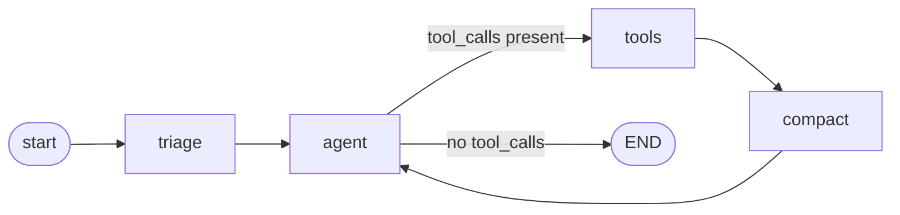

# Architecture

This document describes how the token-efficient CI-triage agent is built: the
LangGraph state machine, the module responsible for each token-saving lever,
the data that flows between them, and how to extend the system to a new CI
runner or a new tool. For the *why* (the numbers, the motivation), see the
[README](../README.md). This document is the *how*.

## Design principle

Every stage answers one question: **does this token need to exist in the
prompt at all?** The agent is not "a small model" or "a short prompt" — it is a
pipeline where each node either removes tokens before they're spent (pruning,
denylisting, windowing) or reclaims tokens already spent but no longer needed
(compaction, trimming, caching). No single lever is responsible for the 95%
reduction; they compose.

## Module map

| Module | Stage | Responsibility | Depends on LangChain? |
|---|---|---|---|
| `agent/log_pruner.py` | 1. Prune | Regex-extract failure blocks + stack frames from a raw CI log; denylist-filter PR diff hunks | No |
| `agent/windows.py` | 3. Window | Read `path:line` windows and file outlines without pulling whole files into memory | No |
| `agent/tools.py` | 3. Window | Wrap `windows.py` as LangChain tools (`read_source_window`, `grep_symbol`, `file_outline`) the model can call | Yes |
| `agent/context.py` | 4. Compact | Trim history to a token ceiling, digest tool payloads, strip stale results, fold old turns into a summary | Yes |
| `agent/cache.py` | 4. Cache | Exact-match `SQLiteCache` + a static-first system prompt so provider prefix caching hits | Yes |
| `agent/retrieval.py` | 5. Retrieve | Split → dedupe → relevance-filter → extract pipeline in front of any vector retriever | Yes |
| `agent/prompts.py` | — | Single source of truth for prompt text; dependency-free so tests/benchmarks run without LangChain | No |
| `agent/config.py` | — | All tunable knobs (`TokenBudget`) and the diff denylist, in one place | No |
| `agent/tokens.py` | — | Token counting (`tiktoken`, falls back to a 4-chars/token heuristic) | No |
| `agent/graph.py` | — | Wires every stage into the LangGraph `StateGraph` | Yes |
| `run_triage.py` | — | CLI entry point | Yes |
| `benchmarks/compare.py` | — | Offline naive-vs-optimized token accounting, no API key needed | No |

Modules that don't need LangChain (pruner, windows, tokens, prompts, config)
are kept import-clean of it on purpose: the benchmark and most unit tests run
in a bare Python environment with no framework or network dependency.

## State schema

The graph's state (`TriageState` in `graph.py`) is a `TypedDict`:

```python
class TriageState(TypedDict):
    messages: Annotated[list[BaseMessage], add_messages]
    raw_log: str
    raw_diff: str
    prompt_tokens: Annotated[int, operator.add]
```

* `messages` uses LangGraph's `add_messages` reducer, **not** `operator.add`.
  This is load-bearing: `add_messages` replaces a message in place when an
  update reuses its `id`, which is exactly how the `compact` node shrinks a
  tool result after it's produced. Swap in `operator.add` and the compacted
  copy is appended instead of replacing the original — a silent regression the
  test suite pins down in `test_tool_payload_is_compacted`.
* `prompt_tokens` accumulates across turns (`operator.add`) so the graph
  reports the true cumulative cost of a run, not just the last call.

## Graph shape and control flow



| Node | Token cost | What it does |
|---|---|---|
| `triage` | Zero | Deterministic Python: prune the log, filter the diff, emit the first `HumanMessage`. No model call. |
| `agent` | Full prompt | Strip stale tool payloads → trim history to budget → call the model. Model may reply with content or tool calls. |
| `tools` | Tool-call cost | `ToolNode` executes whichever of `read_source_window` / `grep_symbol` / `file_outline` the model chose. |
| `compact` | Zero (rewrite only) | Rewrites the `ToolMessage`s just produced into head/tail digests, in place, using the same message `id`. |

`should_continue` routes `agent → tools` while the last message carries
`tool_calls`, and `agent → END` once the model answers without calling a tool.
The loop is capped with `recursion_limit=12` in `run()` as a safety net against
a model that never converges.

### Turn-by-turn walkthrough

1. **`triage`** — `prune_ci_log` regex-matches pytest failure banners
   (`____ test_name ____`), stack frames (`File "...", line N, in func`), and
   exception lines, discarding install/progress noise. `filter_diff` drops
   diff hunks for denylisted paths (lockfiles, `dist/`, snapshots, generated
   protobufs). The result: a system prompt plus one `HumanMessage` containing
   a ~60-line failure report instead of a ~40k-line log.
2. **`agent`** (first pass) — history is just `[system, human]`, so trimming
   and stripping are no-ops. The model reasons over the failure report and, if
   it needs more context, emits a tool call (e.g. `file_outline` on the file
   named in the culprit frame).
3. **`tools`** — `ToolNode` runs the requested tool and appends a
   `ToolMessage` with the raw result (an outline, a grep hit list, or a
   ±40-line window).
4. **`compact`** — walks the message list backward while messages are
   `ToolMessage`s, replacing each one's content with
   `compact_tool_result(name, payload)`: head + tail slices around an elision
   marker, reusing the original message `id` so `add_messages` overwrites
   rather than appends.
5. **`agent`** (subsequent passes) — `strip_stale_tool_payloads` reduces any
   tool result older than the newest 2 to a one-line receipt
   (`"[tool: result consumed, N tokens reclaimed]"`), then `trim_history`
   token-counts the remaining messages and drops whole turns from the front
   until the total is under `BUDGET.max_history_tokens`, always keeping the
   system message and starting the window on a `HumanMessage` so a tool call
   is never orphaned from its result.
6. Loop until the model answers with `ROOT CAUSE / FIX / CONFIDENCE` and no
   tool call — control routes to `END`.

## The five levers, mapped to code

1. **Deterministic pruning** (`log_pruner.py`) — regex over Python, zero
   tokens. `Failure.culprit_frame` picks the deepest stack frame that isn't in
   `site-packages`/`lib/python`/the diff denylist, so the report points at
   *your* code, not the test runner's internals.
2. **Denylist filtering** (`config.DIFF_DENYLIST`, `log_pruner.filter_diff`) —
   a single tuple of substrings shared between diff filtering and
   `StackFrame.is_project_code`, so "don't show me this path" is defined once.
3. **Windowed reads** (`windows.py` → `tools.py`) — `outline()` gives a
   defs/classes map at a few percent of a full read's cost;
   `read_window(path, line, radius)` returns `2*radius` lines centered on a
   line number, numbered for citation. `tools.py` exposes both as LangChain
   `@tool`s with docstrings that explicitly steer the model away from a
   hypothetical `read_file` tool (which is deliberately not provided).
4. **History compaction** (`context.py`) — three independent techniques:
   `trim_history` (token-budget truncation via `trim_messages`),
   `strip_stale_tool_payloads` (turn old tool results into receipts),
   `compact_tool_result` (head/tail digest at production time), plus
   `summarize_old_turns` for LLM-based folding of very long conversations into
   a `[COMPACTED STATE]` block on the cheap model.
5. **Caching** (`cache.py`) — `enable_response_cache()` installs a
   `SQLiteCache` (falls back to `InMemoryCache` if `langchain_community` or a
   writable path isn't available) so identical retries/reruns cost nothing.
   `stable_system_prompt()` guarantees the static persona/rules text always
   comes first and byte-identical, which is a precondition for provider-side
   prompt-prefix caching to fire at all.

## Retrieval pipeline (optional, `retrieval.py`)

Not part of the CI-triage graph itself, but shipped for callers who bolt a
vector store onto the agent (e.g. searching a knowledge base of past
incidents). `build_compressed_retriever` wraps a base retriever in a
`DocumentCompressorPipeline`:

```
base_retriever (k=top_k_before_rerank)
    → CharacterTextSplitter (500-char chunks)
    → EmbeddingsRedundantFilter (drop near-duplicates, cosine ≥ 0.95)
    → EmbeddingsFilter (keep top_k_after_rerank by embedding relevance)
    → [optional] LLMChainExtractor (extract only the relevant sentences)
```

Ordering matters: cheap embedding-based stages cut the candidate set from 20
to 3 *before* the expensive `LLMChainExtractor` ever runs, so the priciest
stage sees the fewest tokens.

## Configuration (`config.py`)

`TokenBudget` centralizes every recall-vs-cost knob so a benchmark sweep never
has to touch agent logic:

| Field | Default | Used by |
|---|---|---|
| `max_history_tokens` | 3,000 | `context.trim_history` |
| `keep_recent_turns` | 6 | `context.summarize_old_turns` |
| `source_window_lines` | 40 | `windows.read_window` |
| `tool_result_char_limit` | 800 | `context.compact_tool_result` |
| `top_k_before_rerank` | 20 | `retrieval.build_compressed_retriever` |
| `top_k_after_rerank` | 3 | `retrieval.build_compressed_retriever` |

`Models` reads `CHEAP_MODEL`/`SMART_MODEL` env vars (defaults `gpt-4o-mini` /
`gpt-4o`) so summarization and triage can run on a cheaper model than the
final diagnosis.

## Token accounting (`tokens.py`)

`count_tokens` uses `tiktoken`'s `cl100k_base` encoding when installed,
otherwise a `len(text) // 4` heuristic — good enough for measuring *ratios*
(what the benchmark reports) but not exact billing. `count_message_tokens`
adds a flat +4 tokens/message for chat-format role/delimiter overhead and
flattens multimodal content blocks to their text parts before counting.

## Testing strategy

* `tests/test_log_pruner.py` — fidelity of the regex extraction: does it find
  every failure, does `culprit_frame` correctly skip `site-packages` frames.
* `tests/test_windows.py` — `read_window`/`outline` correctness on synthetic
  files.
* `tests/test_graph.py` — graph wiring, including
  `test_tool_payload_is_compacted`, which specifically pins the `add_messages`
  reducer behavior described above using a fake LLM (no network/API key).
* `benchmarks/compare.py` — not a test, but an executable spec: it recomputes
  the naive-vs-optimized token table on every run so the README numbers can
  never silently drift from the code.

Run everything with `pytest` (16 tests, offline, no network calls).

## Extending the agent

* **New CI runner** — `Failure`/`StackFrame` are runner-agnostic; only the
  regexes in `log_pruner.py` (`FAILURE_BANNER`, `STACK_FRAME`,
  `SHORT_SUMMARY`, `EXCEPTION_LINE`, `NOISE`) target pytest's output format.
  Add a parallel set for another runner (e.g. Jest, JUnit XML) and keep the
  `Failure`/`StackFrame` shape so `render_failures` and `culprit_frame` keep
  working unmodified.
* **New tool** — add it to `TOOLS` in `tools.py` with a docstring that states
  its token cost relative to the alternative (this is read by the model, not
  just humans) and make sure it returns locations/slices, not full bodies.
* **New denylist entry** — append to `config.DIFF_DENYLIST`; it's consumed by
  both `filter_diff` and `StackFrame.is_project_code` automatically.
* **Tightening the budget** — adjust `TokenBudget` fields and re-run
  `pytest`; the fidelity assertions (`test_finds_every_failure`,
  `test_culprit_frame_skips_site_packages`) are the floor below which pruning
  starts costing correctness, not just tokens.
