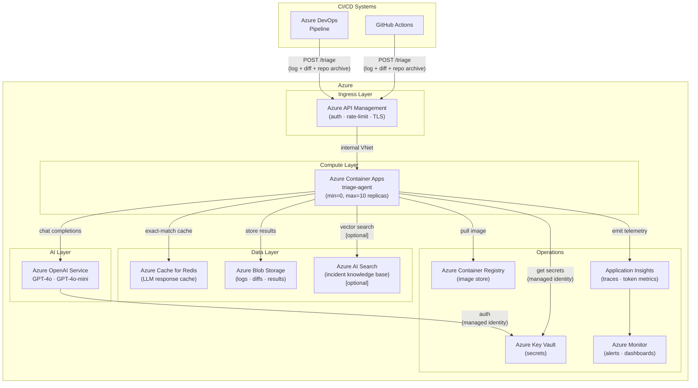
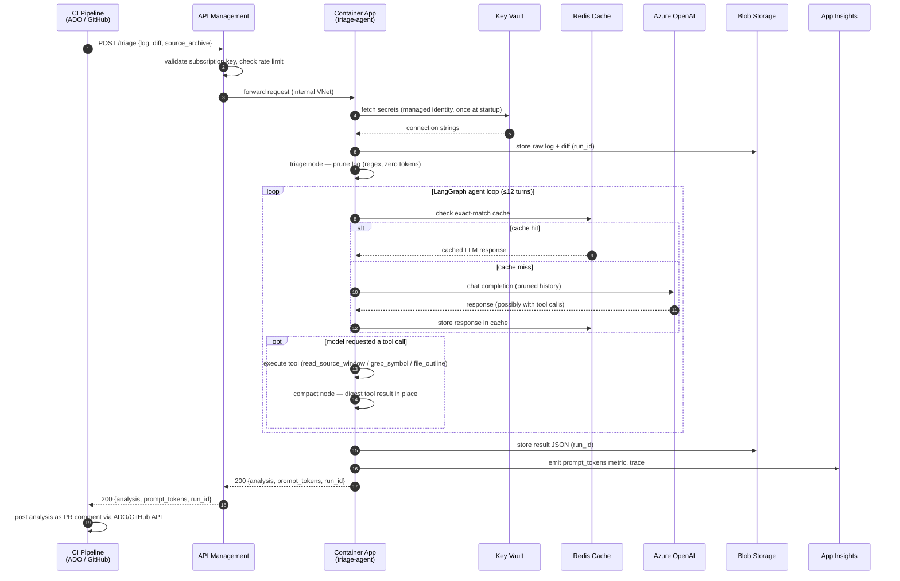
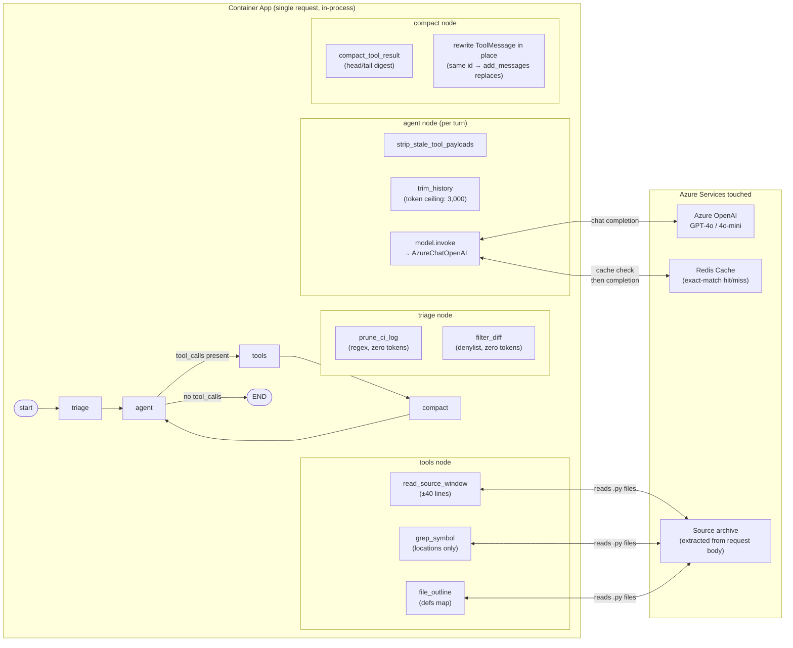
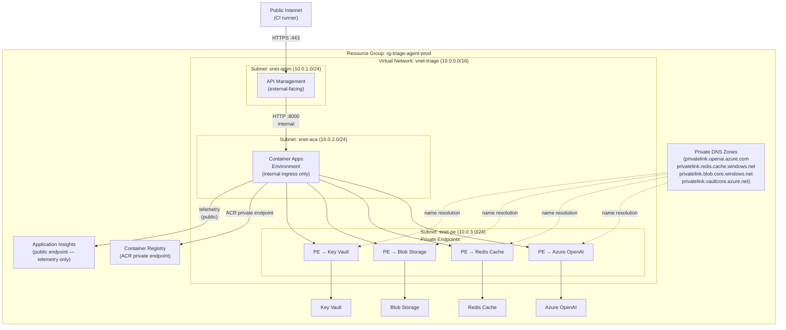
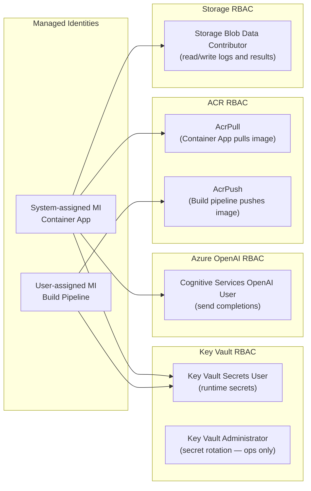
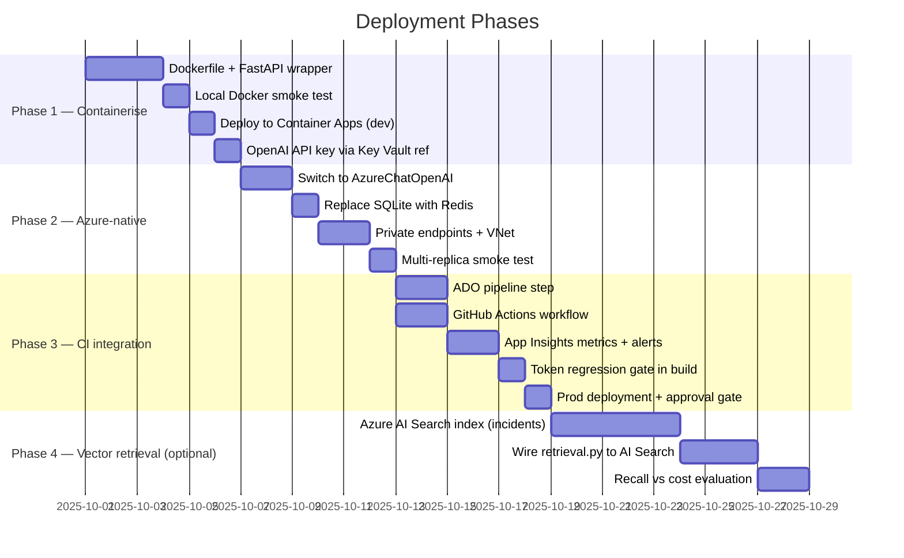

# Azure Architecture — Token-Efficient CI Triage Agent

This document describes how to host the token-efficient LangGraph CI triage agent in
Azure. It covers the full architecture, component choices, data flows, network design,
security model, CI/CD integration, and operations.

For the agent's internal design (LangGraph graph, token-saving levers, module map),
see [ARCHITECTURE.md](ARCHITECTURE.md). For the benchmark numbers that motivate this
work, see the [README](../README.md).

---

## Contents

1. [Architecture overview](#1-architecture-overview)
2. [Component decisions](#2-component-decisions)
3. [Request lifecycle](#3-request-lifecycle)
4. [Agent internals mapped to Azure](#4-agent-internals-mapped-to-azure)
5. [Network topology](#5-network-topology)
6. [Security model](#6-security-model)
7. [CI/CD integration](#7-cicd-integration)
8. [Agent deployment pipeline](#8-agent-deployment-pipeline)
9. [Observability](#9-observability)
10. [Cost model](#10-cost-model)
11. [Code changes required](#11-code-changes-required)
12. [Phased rollout](#12-phased-rollout)

---

## 1. Architecture overview

The agent takes a CI log and a PR diff, runs a multi-turn LangGraph loop to identify
the root cause, and returns a structured diagnosis. In Azure, this becomes an
event-driven HTTP service triggered by CI failures.



### Key design choices at a glance

| Decision | Choice | Reason |
|---|---|---|
| Compute | Azure Container Apps | Scales to zero; no cold-start on Functions for 30–60 s loops |
| LLM | Azure OpenAI | Same API surface as OpenAI; managed identity auth; data residency |
| Cache | Azure Cache for Redis | Shared across replicas; SQLite is single-replica only |
| Auth | Managed Identity → Key Vault | No secrets in environment variables or container images |
| Source access | Bundled in request body | No filesystem; CI already has the repo checked out |
| Trigger | HTTP webhook from pipeline | Decouples agent from CI system type |

---

## 2. Component decisions

### 2.1 Azure Container Apps

The agent runs as a Python process executing a LangGraph loop of up to 12 recursive
turns. Each turn makes an HTTP call to Azure OpenAI. Total wall time per request is
typically 20–90 seconds depending on model latency and number of tool calls.

Azure Functions Consumption plan is unsuitable here: the default 5-minute timeout is
sufficient, but the invocation model creates friction for streaming and stateful
in-process loops. Container Apps provides a clean HTTP server model with autoscaling.

```
min replicas = 0    → zero cost when idle
max replicas = 10   → burst capacity for parallel CI failures
scale trigger       → HTTP concurrent requests (threshold: 5 per replica)
CPU / memory        → 1.0 vCPU / 2 GiB per replica
```

### 2.2 Azure OpenAI

Drop-in replacement for the current `ChatOpenAI` via `AzureChatOpenAI`. The existing
`stable_system_prompt()` function already satisfies the byte-identical prefix
requirement for provider-side **prompt prefix caching** — no code changes needed to
benefit from it.

Deploy two model versions in one Azure OpenAI resource:

| Deployment name | Model | Used for |
|---|---|---|
| `gpt-4o` | GPT-4o | Final diagnosis (`SMART_MODEL`) |
| `gpt-4o-mini` | GPT-4o-mini | History summarisation (`CHEAP_MODEL`) |

### 2.3 Azure Cache for Redis (replacing SQLite)

`cache.py` installs a `SQLiteCache` that writes to `.langchain.db` on the local
filesystem. With multiple Container App replicas, each replica would maintain its own
isolated cache — re-running identical prompts would still hit the model on other
replicas.

Redis provides a single shared cache across all replicas. The LangChain
`RedisCache` adapter is a one-line swap (see [section 11](#11-code-changes-required)).

Tier: **C1 Basic** (1 GB). At 200 runs/day × 10 LLM calls/run, each cached response
is typically 500–2,000 bytes of JSON. C1 is comfortably under capacity.

TTL: 7 days. CI triage for the same failure on a retry is semantically identical, but
results for a fixed bug are stale after the fix merges.

### 2.4 Azure Blob Storage

Three containers:

| Container | Contents | Retention |
|---|---|---|
| `triage-inputs` | Raw CI log + diff per run | 30 days |
| `triage-results` | Full agent output (JSON) | 90 days |
| `triage-sources` | Repo source archives (optional) | 1 day |

Run ID (UUID) is the blob name prefix so a result is always traceable to its input.

### 2.5 Azure API Management (Consumption tier)

Responsibilities:
- TLS termination
- Subscription-key authentication for the pipeline caller
- Rate limiting: 60 requests/minute per subscription to protect the OpenAI quota
- Request size validation (reject payloads > 10 MB before they reach the container)
- Backend URL points to the Container App's internal ingress — the Container App is
  never directly reachable from the internet

### 2.6 Azure Key Vault

All secrets and configuration that must not appear in environment variables or image
layers. Container App reads them via **Key Vault references** — secrets are projected
as environment variables at runtime using the app's system-assigned managed identity.

| Secret name | Value |
|---|---|
| `aoai-endpoint` | `https://<resource>.openai.azure.com/` |
| `redis-connection-string` | Full Redis connection string with auth |
| `storage-connection-string` | Blob Storage connection string |
| `appinsights-connection-string` | Application Insights connection string |

### 2.7 Application Insights + Azure Monitor

The `prompt_tokens` field accumulated in `TriageState` is emitted as a custom metric
after every run. This makes the token budget a first-class observable quantity —
not just a stdout line in a log.

---

## 3. Request lifecycle

The sequence from a CI failure to a PR comment.



---

## 4. Agent internals mapped to Azure

The LangGraph graph runs entirely in-process inside the Container App. This diagram
shows which Azure services each graph node touches.



### Node token costs

| Node | Azure OpenAI calls | Token cost |
|---|---|---|
| `triage` | 0 | Zero — pure Python regex |
| `agent` | 1 per turn | ~9,205 prompt tokens across all turns (optimised) |
| `tools` | 0 | Zero — local file reads |
| `compact` | 0 | Zero — string truncation |

---

## 5. Network topology

All traffic between Azure services stays on the Microsoft backbone. The Container App
is never reachable from the public internet directly.



### Network rules summary

| From | To | Protocol | Port | Note |
|---|---|---|---|---|
| Internet | APIM | HTTPS | 443 | Only entry point |
| APIM | Container Apps | HTTP | 8000 | Internal VNet only |
| Container Apps | All Azure services | HTTPS | 443 | Via private endpoints |
| Container Apps | Application Insights | HTTPS | 443 | Public endpoint (telemetry only) |
| All other | Container Apps | — | — | Denied |

---

## 6. Security model



### Security controls

| Control | Implementation |
|---|---|
| No secrets in code or env vars | Key Vault references projected as env vars at runtime |
| No secret rotation downtime | Key Vault reference re-reads on Container App restart |
| LLM API auth | Managed identity (`DefaultAzureCredential`) — no API keys |
| Inbound auth | APIM subscription key checked before any request reaches ACA |
| Network isolation | Container App on internal ingress; all services on private endpoints |
| Image signing | ACR with Content Trust; Container App rejects unsigned images |
| Supply chain | Dependabot on `requirements.txt`; base image pinned by digest |
| Audit log | Azure Monitor activity log on Key Vault, APIM, Container Apps |

---

## 7. CI/CD integration

### 7.1 Azure DevOps

Add a pipeline step that runs **after** the test stage and only on failure. The step
sends the CI log and PR diff to the triage endpoint and posts the result as a PR
comment.

```yaml
# azure-pipelines.yml

stages:
  - stage: Test
    jobs:
      - job: RunTests
        steps:
          - script: pytest --tb=long 2>&1 | tee ci.log
            displayName: Run tests
            continueOnError: true

          - task: Bash@3
            displayName: Triage CI failure
            condition: failed()
            env:
              TRIAGE_API_KEY: $(TRIAGE_API_KEY)     # pipeline variable (secret)
              TRIAGE_ENDPOINT: $(TRIAGE_ENDPOINT)   # pipeline variable
              ADO_TOKEN: $(System.AccessToken)
            inputs:
              script: |
                # Bundle source .py files (already checked out)
                find . -name "*.py" \
                  -not -path "./.venv/*" \
                  -not -path "./node_modules/*" \
                  | tar czf source.tar.gz -T -

                RESPONSE=$(curl -sf -X POST "$TRIAGE_ENDPOINT/triage" \
                  -H "Ocp-Apim-Subscription-Key: $TRIAGE_API_KEY" \
                  -H "Content-Type: application/json" \
                  -d "{
                    \"raw_log\":         $(cat ci.log | jq -Rs .),
                    \"raw_diff\":        $(git diff origin/$(System.PullRequest.TargetBranch) | jq -Rs .),
                    \"source_archive\":  $(base64 -w0 source.tar.gz | jq -Rs .)
                  }")

                ANALYSIS=$(echo "$RESPONSE" | jq -r '.analysis')
                TOKENS=$(echo "$RESPONSE"   | jq -r '.prompt_tokens')
                RUN_ID=$(echo "$RESPONSE"   | jq -r '.run_id')

                # Post to PR comment via ADO REST API
                curl -sf -X POST \
                  "$(System.TeamFoundationCollectionUri)$(System.TeamProject)/_apis/git/repositories/$(Build.Repository.Name)/pullRequests/$(System.PullRequest.PullRequestId)/threads?api-version=7.1" \
                  -H "Authorization: Bearer $ADO_TOKEN" \
                  -H "Content-Type: application/json" \
                  -d "{
                    \"comments\": [{
                      \"parentCommentId\": 0,
                      \"content\": \"## CI Triage\n\n$ANALYSIS\n\n---\n_prompt tokens: $TOKENS · run: $RUN_ID_\",
                      \"commentType\": 1
                    }],
                    \"status\": 1
                  }"
```

### 7.2 GitHub Actions

```yaml
# .github/workflows/triage.yml

name: CI Triage
on:
  workflow_run:
    workflows: ["CI"]
    types: [completed]

jobs:
  triage:
    if: ${{ github.event.workflow_run.conclusion == 'failure' }}
    runs-on: ubuntu-latest
    permissions:
      pull-requests: write

    steps:
      - uses: actions/checkout@v4
        with:
          ref: ${{ github.event.workflow_run.head_sha }}
          fetch-depth: 0

      - name: Download CI log artifact
        uses: actions/download-artifact@v4
        with:
          name: ci-log
          run-id: ${{ github.event.workflow_run.id }}
          github-token: ${{ secrets.GITHUB_TOKEN }}

      - name: Bundle source files
        run: |
          find . -name "*.py" \
            -not -path "./.venv/*" \
            -not -path "./node_modules/*" \
            | tar czf source.tar.gz -T -

      - name: Triage failure
        env:
          TRIAGE_API_KEY: ${{ secrets.TRIAGE_API_KEY }}
          TRIAGE_ENDPOINT: ${{ secrets.TRIAGE_ENDPOINT }}
        run: |
          RESPONSE=$(curl -sf -X POST "$TRIAGE_ENDPOINT/triage" \
            -H "Ocp-Apim-Subscription-Key: $TRIAGE_API_KEY" \
            -H "Content-Type: application/json" \
            -d "{
              \"raw_log\":         $(cat ci.log | jq -Rs .),
              \"raw_diff\":        $(git diff origin/${{ github.event.workflow_run.head_branch }} | jq -Rs .),
              \"source_archive\":  $(base64 -w0 source.tar.gz | jq -Rs .)
            }")

          echo "ANALYSIS<<EOF" >> $GITHUB_ENV
          echo "$RESPONSE" | jq -r '.analysis' >> $GITHUB_ENV
          echo "EOF" >> $GITHUB_ENV
          echo "RUN_ID=$(echo "$RESPONSE" | jq -r '.run_id')" >> $GITHUB_ENV
          echo "TOKENS=$(echo "$RESPONSE" | jq -r '.prompt_tokens')" >> $GITHUB_ENV

      - name: Post PR comment
        uses: actions/github-script@v7
        with:
          script: |
            const prNumber = context.payload.workflow_run.pull_requests[0]?.number;
            if (!prNumber) { core.warning('No PR found for this run'); return; }
            await github.rest.issues.createComment({
              owner: context.repo.owner,
              repo: context.repo.repo,
              issue_number: prNumber,
              body: `## CI Triage\n\n${process.env.ANALYSIS}\n\n---\n_prompt tokens: ${process.env.TOKENS} · run: ${process.env.RUN_ID}_`
            });
```

---

## 8. Agent deployment pipeline

This is the pipeline that builds and deploys the triage agent itself — separate from
the CI integration in section 7.

```mermaid
flowchart LR
    subgraph dev ["Developer"]
        PR["Pull Request\nto main"]
    end

    subgraph build ["Build Stage"]
        Lint["ruff / mypy"]
        Test["pytest\n(16 tests, offline)"]
        Bench["benchmarks/compare.py\n(token regression gate)"]
        Docker["docker build\n(pin base image by digest)"]
        Push["docker push\nto ACR"]
    end

    subgraph deploy ["Deploy Stage"]
        DevDeploy["Deploy to\ntriage-agent-dev\n(Container App)"]
        SmokeTest["Smoke test\nPOST /triage --demo"]
        ProdApproval["Manual approval\n(required for prod)"]
        ProdDeploy["Deploy to\ntriage-agent-prod\n(Container App)"]
        Rollback["Rollback trigger\n(alert → revision rollback)"]
    end

    PR --> Lint --> Test --> Bench
    Bench -->|"passes"| Docker --> Push
    Push --> DevDeploy --> SmokeTest
    SmokeTest -->|"passes"| ProdApproval --> ProdDeploy
    ProdDeploy -.->|"token metric spike"| Rollback
```



### Token regression gate

`benchmarks/compare.py` is runnable with no API key. Add it as a build step and fail
the pipeline if the optimised token total exceeds a threshold:

```bash
python benchmarks/compare.py --assert-optimised-below 12000
```

This makes the README's 9,205-token number a hard CI gate — a change that regresses
token efficiency fails before it can reach production.

### Container App revision strategy

Container Apps supports **revision-based deployments**. The deploy step creates a new
revision with zero traffic, runs the smoke test against it, then shifts 100% of traffic
to it. If the `prompt_tokens_per_run` metric spikes above the alert threshold within
10 minutes of the traffic shift, the revision is rolled back automatically via an Azure
Monitor action group calling the Container Apps revision deactivation API.

---

## 9. Observability

### 9.1 Custom metrics

The graph accumulates `prompt_tokens` in `TriageState`. Emit it to Application
Insights after every run alongside the raw log token count so the compression ratio is
directly observable.

```python
# In the FastAPI wrapper, after run() returns:
from applicationinsights import TelemetryClient

tc = TelemetryClient(os.environ["APPINSIGHTS_CONNECTION_STRING"])
tc.track_metric("prompt_tokens_per_run",   result["prompt_tokens"])
tc.track_metric("raw_log_tokens",          count_tokens(raw_log))
tc.track_metric("compression_ratio",
    count_tokens(raw_log) / max(result["prompt_tokens"], 1))
tc.track_metric("cache_hit",               1 if cache_hit else 0)
tc.track_metric("agent_turns",             turn_count)
tc.flush()
```

### 9.2 Alerts

| Alert name | Condition | Action |
|---|---|---|
| Token budget regression | `prompt_tokens_per_run > 20,000` (avg over 5 min) | Email + Teams webhook |
| High error rate | HTTP 5xx > 5% over 5 min | Page on-call |
| Redis cache miss rate | `cache_hit < 0.3` (avg over 1 hour) | Email — investigate model or prompt change |
| Cost spike | Azure OpenAI spend > $50/day | Email |
| Revision rollback trigger | `prompt_tokens_per_run > 15,000` within 10 min of deploy | Container App revision rollback |

### 9.3 Dashboard panels

Recommended Azure Monitor workbook layout:

```
┌──────────────────────────┬──────────────────────────┬──────────────────────┐
│  Runs today              │  Avg prompt tokens/run   │  Cache hit rate      │
│  [count]                 │  [gauge vs 9,205 target] │  [percentage]        │
├──────────────────────────┼──────────────────────────┼──────────────────────┤
│  Prompt tokens over time (line chart, 7-day rolling average)              │
├──────────────────────────┬──────────────────────────┬──────────────────────┤
│  Compression ratio       │  Avg agent turns/run     │  Azure OpenAI spend  │
│  (raw / prompt tokens)   │  [gauge vs limit 12]     │  [cost this month]   │
├──────────────────────────┴──────────────────────────┴──────────────────────┤
│  P95 request latency (ms) — line chart                                    │
│  Error rate (%) — line chart                                              │
└────────────────────────────────────────────────────────────────────────────┘
```

### 9.4 Distributed tracing

LangSmith tracing is available by setting two environment variables. Add them as Key
Vault references on the Container App for production tracing without code changes:

```
LANGCHAIN_TRACING_V2=true
LANGCHAIN_API_KEY=<langsmith-key>
LANGCHAIN_PROJECT=triage-agent-prod
```

LangSmith gives per-turn token counts, tool call traces, and latency breakdowns — the
complement to the aggregate Azure Monitor metrics.

---

## 10. Cost model

Based on 200 runs/day. All prices are approximate USD, East US region, as of 2025.

| Service | Tier | Monthly cost |
|---|---|---|
| Azure OpenAI — GPT-4o (input) | 9,205 tokens × 200/day × 30 days × $2.50/M | ~$14 |
| Azure OpenAI — GPT-4o (output) | ~500 tokens × 200/day × 30 days × $10/M | ~$30 |
| Azure OpenAI — GPT-4o-mini (summaries) | ~1,000 tokens × 200/day × 30 days × $0.15/M | ~$1 |
| Azure Cache for Redis — C1 Basic | Fixed | ~$55 |
| Azure Container Apps | ~1 vCPU-hour/day × 30 × $0.036 | ~$1 |
| Azure API Management — Consumption | 6,000 calls/month × $0.0035/1k | ~$0.02 |
| Azure Blob Storage — LRS Hot | ~5 GB × $0.018/GB | ~$0.09 |
| Azure Container Registry — Basic | Fixed | ~$5 |
| Azure Key Vault | ~20,000 operations × $0.03/10k | ~$0.06 |
| Application Insights | ~500 MB/month × $2.30/GB | ~$1 |
| **Total** | | **~$107/month** |

### Comparison with naive implementation

| Scenario | Monthly cost |
|---|---|
| Naive (201,233 tokens/run, GPT-4o) | ~$3,018 |
| Optimised on Azure (9,205 tokens/run) | ~$107 |
| **Saving** | **~$2,911/month (96.5%)** |

The token-efficiency work pays for the entire Azure hosting cost (including Redis, APIM,
Container Registry, etc.) with **~27× headroom** against a naive GPT-4o implementation.

### Scaling to higher volume

At 1,000 runs/day (5× current):

- Azure OpenAI cost scales linearly: ~$225/month
- Redis, APIM, Container Registry costs are flat
- Container Apps scales automatically; compute cost ~$5/month
- Total: ~$290/month (vs. naive ~$15,090/month)

---

## 11. Code changes required

The five token-saving levers deploy as-is. Only three changes are needed to run in
Azure.

### 11.1 Redis cache (`cache.py`)

```python
def enable_response_cache(path: str | None = ".langchain.db") -> None:
    redis_url = os.getenv("REDIS_URL")
    if redis_url:
        from langchain_community.cache import RedisCache
        import redis as _redis
        set_llm_cache(RedisCache(redis_=_redis.from_url(redis_url), ttl=604800))
        return
    # existing SQLite / InMemoryCache fallback unchanged below
    ...
```

### 11.2 Azure OpenAI client (`run_triage.py` and the FastAPI wrapper)

```python
from langchain_openai import AzureChatOpenAI
from azure.identity import DefaultAzureCredential, get_bearer_token_provider

token_provider = get_bearer_token_provider(
    DefaultAzureCredential(), "https://cognitiveservices.azure.com/.default"
)

llm = AzureChatOpenAI(
    azure_deployment=os.environ["SMART_MODEL"],
    azure_endpoint=os.environ["AZURE_OPENAI_ENDPOINT"],
    api_version="2024-08-01-preview",
    azure_ad_token_provider=token_provider,
    temperature=0,
)
```

### 11.3 Source file access

The `tools.py` functions call `Path.rglob("*.py")` on the local filesystem. In the
Container App, there is no local checkout. The FastAPI wrapper receives a `source_archive`
field (base64-encoded tar.gz from the CI pipeline), extracts it to a per-request temp
directory, and passes that path as the working root.

```python
import base64, tarfile, tempfile

@app.post("/triage")
async def triage(req: TriageRequest) -> TriageResponse:
    with tempfile.TemporaryDirectory() as source_root:
        if req.source_archive:
            archive_bytes = base64.b64decode(req.source_archive)
            with tarfile.open(fileobj=io.BytesIO(archive_bytes)) as tar:
                tar.extractall(source_root)

        os.environ["SOURCE_ROOT"] = source_root   # tools.py reads this
        result = run(llm, req.raw_log, req.raw_diff)
    ...
```

These three changes are the only ones that affect agent behaviour. Everything in
`log_pruner.py`, `context.py`, `windows.py`, `tokens.py`, `prompts.py`, `config.py`,
and `graph.py` is unchanged.

---

## 12. Phased rollout



### Phase gates

| Gate | Criterion | Blocks |
|---|---|---|
| Phase 1 → 2 | `POST /triage --demo` returns a valid diagnosis in dev | Phase 2 start |
| Phase 2 → 3 | Multi-replica test: same prompt from 2 replicas returns identical result (Redis cache hit on second call) | Phase 3 start |
| Phase 3 → prod | Token regression gate passes: `benchmarks/compare.py` reports < 12,000 optimised tokens | Prod deployment |
| Prod → Phase 4 | 2 weeks stable in prod with no budget regression alerts | Phase 4 start |
